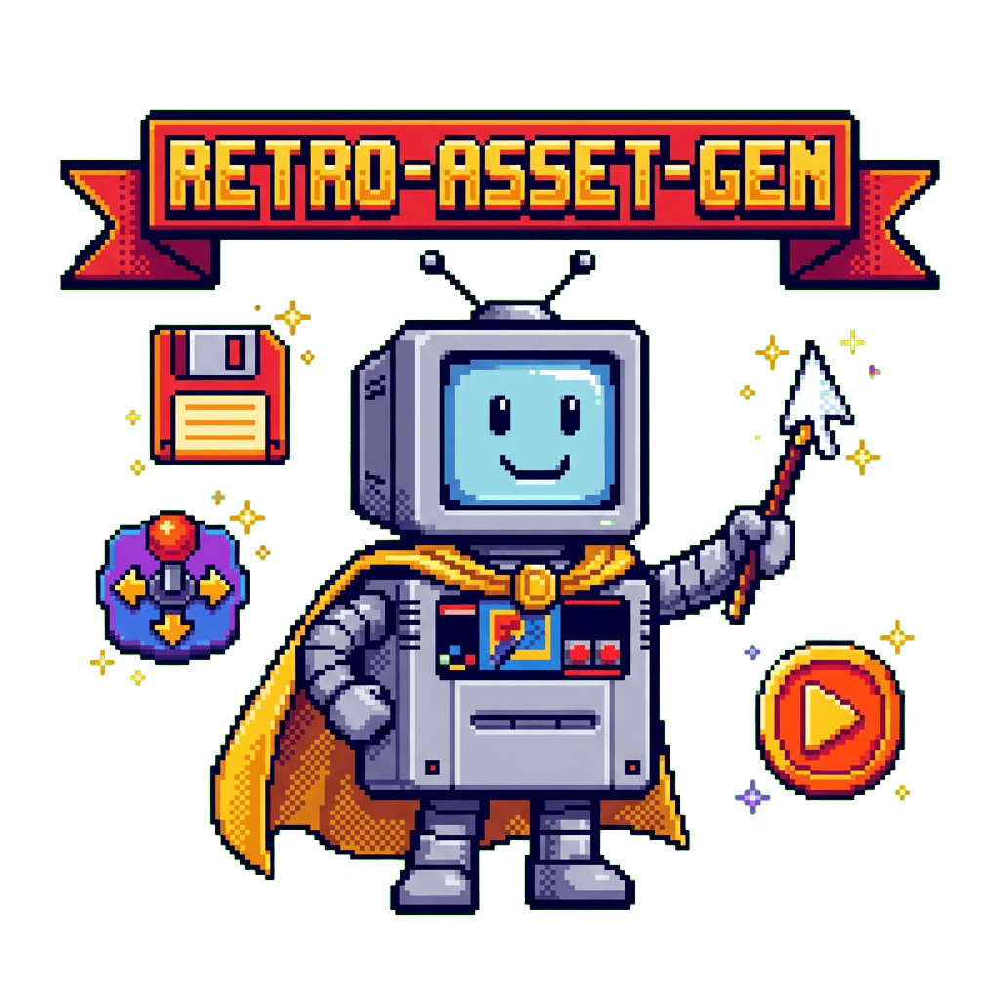

<div align="center">
  

  [](https://www.python.org/)
  [](https://github.com/tsilva/retro-asset-gen)
  [](LICENSE)

  **🎮 Generate retro gaming platform assets using Gemini AI for Pegasus Frontend themes**

  [Workflow](#workflow) · [Configuration](#configuration) · [Development](#development)
</div>

## Overview

retro-asset-gen creates device images and logos for retro gaming platforms using Google's Gemini image generation API. Provide reference images of a console and its logo, and the tool generates theme-ready assets with transparent backgrounds.

## ✨ Features

- **Reference-based generation** - Uses your platform photos and logos as references for accurate reproduction
- **Google Search integration** - Model leverages web search for accurate platform/brand knowledge
- **Accurate text rendering** - Reliable reproduction of logo text and typography
- **High resolution output** - 2K resolution (2160x2160 devices, 1920x510 logos)
- **Alpha matting** - Clean transparent backgrounds using difference matting technique
- **PNG quantization** - Smaller file sizes with libimagequant
- **Theme deployment** - Direct deployment to Pegasus COLORFUL theme structure

## 📋 Requirements

- Python 3.11+
- [uv](https://docs.astral.sh/uv/) (recommended) or pip
- Gemini API key

## 🚀 Quick Start

```bash
# Clone and install
git clone https://github.com/tsilva/retro-asset-gen.git
cd retro-asset-gen
uv sync

# Configure
cp .env.example .env
# Edit .env and add your GEMINI_API_KEY

# Generate assets for a platform
uv run retro-asset-gen generate amigacd32 "Commodore Amiga CD32"
```

## Workflow

### Step 1: Prepare Reference Images

Create an input directory with reference images:

```
.input/<platform_id>/
├── platform.jpg  (or .png) - photo of the console/device
└── logo.png      (or .jpg) - the platform logo
```

Example:
```
.input/amigacd32/
├── platform.jpg  # Photo of the Amiga CD32 console
└── logo.png      # Amiga CD32 logo
```

### Step 2: Generate Assets

```bash
uv run retro-asset-gen generate <platform_id> "<platform_name>"

# Example:
uv run retro-asset-gen generate amigacd32 "Commodore Amiga CD32"

# Options:
#   --force    Overwrite existing assets
```

### Step 3: Deploy to Theme

```bash
uv run retro-asset-gen deploy

# Options:
#   <platform_id>     Deploy only this platform (omit for all)
#   --theme, -t       Theme name from themes.yaml (default: colorful)
#   --dry-run, -n     Show what would be copied without copying

# Examples:
uv run retro-asset-gen deploy                    # Deploy all platforms
uv run retro-asset-gen deploy amigacd32          # Deploy single platform
uv run retro-asset-gen deploy -n                 # Dry run
```

### Additional Commands

```bash
# List generated platforms
uv run retro-asset-gen list

# Manage themes
uv run retro-asset-gen themes           # List themes
uv run retro-asset-gen themes --init    # Create themes.yaml

# Show configuration
uv run retro-asset-gen config

# Get help
uv run retro-asset-gen --help
```

## 📁 Output Structure

Assets are generated to match the COLORFUL theme structure:

```
output/
└── assets/
    └── images/
        ├── devices/
        │   └── <platform_id>.png
        └── logos/
            ├── Dark - Black/
            │   └── <platform_id>.png
            ├── Dark - Color/
            │   └── <platform_id>.png
            ├── Light - Color/
            │   └── <platform_id>.png
            └── Light - White/
                └── <platform_id>.png
```

### Asset Specifications

| Asset | Dimensions | Description |
|-------|------------|-------------|
| `devices/<platform_id>.png` | 2160x2160 | Device/console image |
| `logos/Light - Color/<platform_id>.png` | 1920x510 | Color logo (transparent) |
| `logos/Dark - Color/<platform_id>.png` | 1920x510 | Color logo (transparent) |
| `logos/Dark - Black/<platform_id>.png` | 1920x510 | White monochrome logo |
| `logos/Light - White/<platform_id>.png` | 1920x510 | Black monochrome logo |

## ⚙️ Configuration

### Environment Variables

| Variable | Required | Default | Description |
|----------|----------|---------|-------------|
| `GEMINI_API_KEY` | Yes | - | Your Gemini API key |
| `RETRO_INPUT_DIR` | No | `.input` | Input directory for references |
| `RETRO_OUTPUT_DIR` | No | `output` | Output directory |
| `RETRO_QUANTIZE` | No | `true` | Enable PNG quantization |
| `RETRO_QUANTIZE_QUALITY` | No | `65-80` | Quantization quality range |

### themes.yaml

Theme configuration file in project root:

```yaml
themes:
  colorful:
    base_path: "/path/to/theme"
    assets_dir: "assets/images/{platform_id}"
    files:
      device: "device.png"
      logo_dark_color: "logo_dark_color.png"
      # ...
```

Create with: `retro-asset-gen themes --init`

## 🔧 How It Works

### Device Image Generation

1. **Generate on white background** - Gemini creates the device render
2. **Convert to black background** - Same image edited to black background
3. **Difference matting** - Compares both to mathematically extract transparency

This technique preserves semi-transparent pixels (glass, shadows) and creates clean edges without color halos.

### Logo Generation

1. **Generate with reference** - Gemini recreates the logo from your reference image
2. **Chroma key extraction** - White background converted to transparency
3. **Variant creation** - Generates monochrome versions for different theme modes

## 🛠️ Development

```bash
# Install with dev dependencies
uv sync --all-extras

# Run linting
uv run ruff check src/

# Run type checking
uv run mypy src/

# Run tests
uv run pytest
```

## 📄 License

MIT
